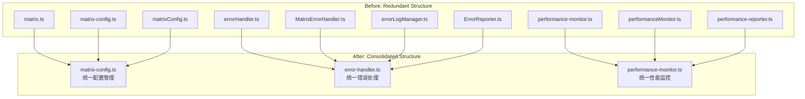

# Design Document: Project Redundancy Cleanup

## Overview

本设计文档描述了项目冗余清理的技术方案。目标是将分散的、功能重叠的模块整合为统一的、职责清晰的模块，同时保持向后兼容性。

整合将分四个阶段进行：
1. **Phase 1 (CRITICAL)**: Matrix 配置、错误处理、性能监控
2. **Phase 2 (HIGH)**: 消息服务、事件系统、WebSocket Store
3. **Phase 3 (MEDIUM)**: 房间服务、类型定义、ESLint 配置
4. **Phase 4 (LOW)**: Hooks、Composables、适配器

## Architecture



## Components and Interfaces

### 1. Matrix Config Manager (统一配置管理)

**目标文件**: `src/config/matrix-config.ts`

**整合来源**:
- `src/config/matrix.ts` → 房间别名常量
- `src/config/matrixConfig.ts` → 服务发现功能

```typescript
// 统一接口
export interface MatrixConfig {
  serverName: string
  homeserverUrl: string | null
  capabilities: any | null
  discovered: boolean
}

export interface MatrixConfigManager {
  // 从 matrixConfig.ts 合并
  discoverServer(serverName?: string): Promise<DiscoveryResult>
  getMatrixConfig(): MatrixConfig
  getHomeserverUrl(): string | null
  resetConfig(): void
  
  // 从 matrix-config.ts 保留
  initializeWithDiscovery(serverName?: string): Promise<DiscoveryResult>
  getConfig(): MatrixConfigOptions
  
  // 从 matrix.ts 合并
  PUBLIC_ROOM_ALIASES: string[]
  PUBLIC_ROOM_ALIAS: string
}

// 向后兼容导出
export { discoverServer, getMatrixConfig, getHomeserverUrl } // 旧 API
export { PUBLIC_ROOM_ALIASES, PUBLIC_ROOM_ALIAS } // 常量
```

### 2. Error Handler (统一错误处理)

**目标文件**: `src/utils/error-handler.ts`

**整合来源**:
- `src/utils/errorHandler.ts` → 主要错误处理逻辑
- `src/utils/MatrixErrorHandler.ts` → Matrix 特定错误处理
- `src/utils/errorLogManager.ts` → 错误日志管理
- `src/utils/ErrorReporter.ts` → 错误报告

```typescript
// 统一接口
export interface StandardError {
  id: string
  category: ErrorCategory
  code: string
  message: string
  userMessage: string
  timestamp: number
  context?: ErrorContext
  recoverable: boolean
  suggestedAction?: ErrorAction
}

export interface ErrorHandler {
  // 核心功能
  handleError(error: RawError, context?: ErrorContext): StandardError
  retryError<T>(errorId: string, retryFn: () => Promise<T>): Promise<T>
  resolveError(errorId: string, feedback?: string): void
  
  // 日志功能 (从 errorLogManager 合并)
  logError(error: StandardError): void
  getErrorLog(): StandardError[]
  clearErrorLog(): void
  
  // 报告功能 (从 ErrorReporter 合并)
  reportError(error: StandardError): Promise<void>
  setReportingEnabled(enabled: boolean): void
}

// 便捷函数导出
export const handleError = (error, context?) => errorHandler.handleError(error, context)
export const retryError = (errorId, retryFn) => errorHandler.retryError(errorId, retryFn)
```

### 3. Performance Monitor (统一性能监控)

**目标文件**: `src/utils/performance-monitor.ts`

**整合来源**:
- `src/utils/performanceMonitor.ts` → 简单监控函数
- `src/utils/performance-reporter.ts` → 报告功能

```typescript
// 统一接口
export interface PerformanceMetric {
  name: string
  value: number
  timestamp: number
  category: string
}

export interface PerformanceMonitor {
  // 核心功能
  start(name: string): void
  end(name: string, category?: string): number
  measure(name: string, startMark: string, endMark: string): number
  
  // 报告功能 (从 performance-reporter 合并)
  getMetrics(): PerformanceMetric[]
  report(): PerformanceReport
  startAutoReporting(interval?: number): void
  stopAutoReporting(): void
  
  // 生命周期
  reset(): void
}

// 全局实例
export const performanceMonitor = new PerformanceMonitor()

// 便捷函数 (向后兼容)
export const createPerformanceMonitor = () => performanceMonitor
export const startPerformanceReporter = () => performanceMonitor.startAutoReporting()
```

### 4. Message Sync Service (统一消息同步)

**目标文件**: `src/services/message-sync-service.ts`

**整合来源**:
- `src/services/message-sync.ts` → 基础同步
- `src/services/messageSyncService.ts` → 高级同步功能

```typescript
// 统一接口
export interface MessageSyncService {
  // 同步功能
  syncHistory(roomId: string, limit?: number): Promise<void>
  syncMessages(roomId: string, since?: string): Promise<Message[]>
  
  // 去重功能 (从 messageSyncService 保留)
  isDuplicate(eventId: string): boolean
  markProcessed(eventId: string): void
  
  // 重试功能
  addToRetryQueue(message: RetryMessage): void
  processRetryQueue(): Promise<void>
  
  // 状态管理
  getMessageStatus(msgId: string): MessageStatusEnum
  updateMessageStatus(msgId: string, status: MessageStatusEnum): void
}
```

### 5. Event System (统一事件系统)

**目标文件**: `src/utils/event-bus.ts`

**整合来源**:
- `src/utils/EventBus.ts` → TypedEventBus (保留为主要实现)
- `src/utils/EventDispatcher.ts` → 废弃，功能合并
- `src/utils/eventManager.ts` → 废弃，功能合并

```typescript
// 统一接口 (基于 TypedEventBus)
export interface EventBus<T extends EventMap = EventMap> {
  on<K extends keyof T>(event: K, handler: EventHandler<T[K]>): () => void
  off<K extends keyof T>(event: K, handler: EventHandler<T[K]>): void
  emit<K extends keyof T>(event: K, payload: T[K]): void
  once<K extends keyof T>(event: K, handler: EventHandler<T[K]>): () => void
  
  // 高级功能
  getHistory(): EventRecord[]
  clearHistory(): void
}

// 专用实例 (保留)
export const globalEventBus = new TypedEventBus({ namespace: 'global' })
export const matrixEventBus = new TypedEventBus({ namespace: 'matrix' })
export const rtcEventBus = new TypedEventBus({ namespace: 'rtc' })
export const chatEventBus = new TypedEventBus({ namespace: 'chat' })

// 向后兼容
export const EventDispatcher = { getInstance: () => globalEventBus }
export const EventManager = { getInstance: () => globalEventBus }
```

### 6. WebSocket Store (统一 WebSocket 状态)

**目标文件**: `src/stores/websocket.ts`

**整合来源**:
- `src/stores/ws.ts` → 登录状态

```typescript
// 统一接口
export const useWebSocketStore = defineStore('websocket', () => {
  // 连接状态 (现有)
  const connected = ref(false)
  const connecting = ref(false)
  const error = ref<string | null>(null)
  const reconnectAttempts = ref(0)
  
  // 登录状态 (从 ws.ts 合并)
  const loginQrCode = ref<string>()
  const loginStatus = ref(LoginStatus.Init)
  
  // 方法
  function setConnected(status: boolean) { ... }
  function setConnecting(status: boolean) { ... }
  function resetLoginState() { ... }
  
  return {
    connected, connecting, error, reconnectAttempts,
    loginQrCode, loginStatus,
    setConnected, setConnecting, resetLoginState
  }
})

// 向后兼容
export const useWsLoginStore = useWebSocketStore
```

## Data Models

### 文件迁移映射

| 原文件 | 目标文件 | 操作 |
|--------|----------|------|
| `src/config/matrix.ts` | `src/config/matrix-config.ts` | 合并常量 |
| `src/config/matrixConfig.ts` | `src/config/matrix-config.ts` | 合并功能 |
| `src/utils/MatrixErrorHandler.ts` | `src/utils/error-handler.ts` | 合并 |
| `src/utils/errorLogManager.ts` | `src/utils/error-handler.ts` | 合并 |
| `src/utils/ErrorReporter.ts` | `src/utils/error-handler.ts` | 合并 |
| `src/utils/performanceMonitor.ts` | `src/utils/performance-monitor.ts` | 合并 |
| `src/utils/performance-reporter.ts` | `src/utils/performance-monitor.ts` | 合并 |
| `src/services/message-sync.ts` | `src/services/message-sync-service.ts` | 合并 |
| `src/utils/EventDispatcher.ts` | `src/utils/event-bus.ts` | 废弃 |
| `src/utils/eventManager.ts` | `src/utils/event-bus.ts` | 废弃 |
| `src/stores/ws.ts` | `src/stores/websocket.ts` | 合并 |

### 废弃策略

```typescript
// 废弃文件模板
/**
 * @deprecated 此文件已废弃，请使用 xxx 替代
 * @see src/xxx/new-file.ts
 * 
 * 此文件将在 v2.0.0 版本移除
 */

// 重新导出以保持兼容
export * from './new-file'

// 添加运行时警告
if (process.env.NODE_ENV === 'development') {
  console.warn('[DEPRECATED] xxx.ts is deprecated, use yyy.ts instead')
}
```

## Correctness Properties

*A property is a characteristic or behavior that should hold true across all valid executions of a system-essentially, a formal statement about what the system should do. Properties serve as the bridge between human-readable specifications and machine-verifiable correctness guarantees.*

### Property 1: Config Discovery Consistency

*For any* valid server name, calling `discoverServer()` multiple times with the same server name should return equivalent results (cached or fresh).

**Validates: Requirements 1.2**

### Property 2: Error Handling Completeness

*For any* error input (Error object, string, or unknown), the error handler should produce a StandardError with all required fields: id, category, code, message, userMessage, timestamp, and recoverable flag.

**Validates: Requirements 2.2**

### Property 3: Performance Metric Tracking

*For any* performance measurement operation (start/end pair), the monitor should correctly track the duration and store it in the metrics collection with the correct category.

**Validates: Requirements 3.2**

### Property 4: Message Deduplication

*For any* set of messages containing duplicates (same eventId), the sync service should produce a set with unique messages only, preserving the first occurrence.

**Validates: Requirements 4.2**

### Property 5: Event Dispatch Delivery

*For any* event emitted on an event bus, all registered subscribers for that event type should receive the payload, and the event should be recorded in the event history.

**Validates: Requirements 5.2**

### Property 6: WebSocket State Consistency

*For any* WebSocket state transition (connected/disconnected/error), all related state fields should be updated atomically and consistently.

**Validates: Requirements 6.2**

## Error Handling

### 迁移错误处理

1. **导入错误**: 当旧导入路径失效时，提供清晰的错误消息指向新路径
2. **类型不兼容**: 使用类型别名保持向后兼容
3. **运行时警告**: 在开发模式下对废弃 API 使用发出警告

### 回滚策略

每个整合阶段应该是独立的，可以单独回滚：
1. 保留原文件直到确认新实现稳定
2. 使用 git 分支管理每个阶段
3. 添加功能开关控制新旧实现切换

## Testing Strategy

### 单元测试

- 验证每个整合模块的核心功能
- 测试向后兼容的导出
- 测试废弃警告在开发模式下正确触发

### 属性测试

使用 `fast-check` 进行属性测试：

```typescript
import fc from 'fast-check'

// Property 1: Config Discovery
fc.assert(
  fc.property(fc.string(), async (serverName) => {
    const result1 = await discoverServer(serverName)
    const result2 = await discoverServer(serverName)
    return deepEqual(result1, result2)
  })
)

// Property 2: Error Handling
fc.assert(
  fc.property(fc.anything(), (error) => {
    const result = handleError(error)
    return (
      result.id !== undefined &&
      result.category !== undefined &&
      result.message !== undefined &&
      result.userMessage !== undefined &&
      result.timestamp !== undefined &&
      typeof result.recoverable === 'boolean'
    )
  })
)

// Property 4: Message Deduplication
fc.assert(
  fc.property(fc.array(fc.record({ eventId: fc.string() })), (messages) => {
    const synced = syncService.deduplicate(messages)
    const uniqueIds = new Set(synced.map(m => m.eventId))
    return uniqueIds.size === synced.length
  })
)
```

### 集成测试

- 验证整合后的模块与现有代码的兼容性
- 测试跨模块交互
- 验证废弃路径的重定向

### 测试配置

- 使用 Vitest 作为测试框架
- 属性测试最少运行 100 次迭代
- 每个属性测试标注对应的设计属性编号

