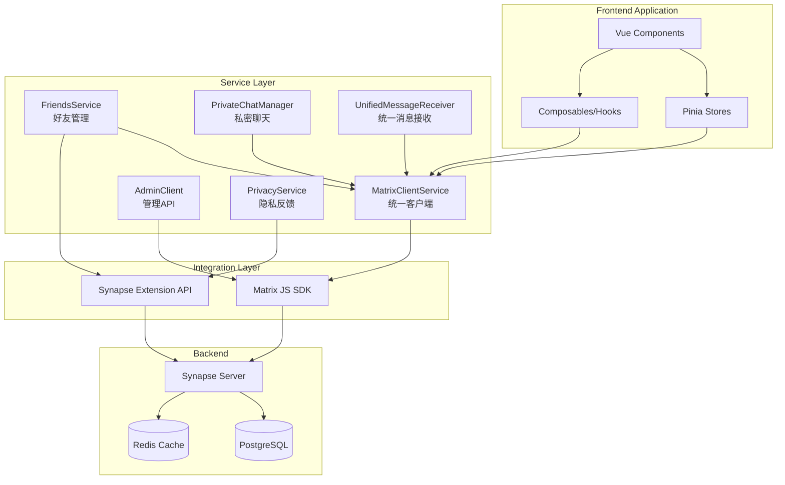

# Design Document: SDK Backend Integration

## Overview

本设计文档描述了Matrix SDK与Synapse后端完整集成的技术方案。目标是解决ProjectAudit.md中发现的问题，并完整实现API.md定义的所有后端功能。

整合将分五个阶段进行：
1. **Phase 1 (CRITICAL)**: 修复核心问题 - 客户端服务统一、消息接收、会话删除
2. **Phase 2 (HIGH)**: 好友系统完整实现 - Synapse API + m.direct fallback
3. **Phase 3 (HIGH)**: 私密聊天与E2EE - 加密、自毁消息、密钥备份
4. **Phase 4 (MEDIUM)**: 管理与隐私功能 - Admin API、举报屏蔽
5. **Phase 5 (LOW)**: 冗余清理与优化 - 代码整合、性能优化

## Architecture



### 服务层职责边界

根据 `REDUNDANT_CODE_CHECKLIST.md` 的分析，明确以下服务的职责边界：

| 服务 | 职责 | 不应包含 |
|------|------|----------|
| `messageService.ts` | 高层 API，对外提供统一接口 | 具体发送逻辑 |
| `enhancedMessageService.ts` | 底层实现，处理具体发送逻辑 | 高层路由 |
| `unifiedMessageReceiver.ts` | 统一消息接收，Matrix事件监听 | 消息发送 |
| `webSocketService.ts` | WebSocket 服务接口 + 协调逻辑 | 具体协议实现 |
| `webSocketRust.ts` | Rust WebSocket 客户端实现 | 协调逻辑 |

## Components and Interfaces

### 1. Matrix Client Service (统一客户端服务)

**位置**: `src/integrations/matrix/client.ts`

**职责**: 作为Matrix客户端的唯一入口点，所有组件必须通过此服务访问客户端。

```typescript
// 统一接口
export interface MatrixClientService {
  // 客户端生命周期
  initialize(config: MatrixClientConfig): Promise<void>
  startClient(options?: StartClientOptions): Promise<void>
  stopClient(): void
  getClient(): MatrixClient | null
  
  // 认证
  loginWithPassword(username: string, password: string): Promise<LoginResponse>
  registerWithPassword(username: string, password: string): Promise<RegisterResponse>
  logout(): Promise<void>
  
  // 配置
  setBaseUrl(url: string): void
  getBaseUrl(): string | null
}

// 确保单例
export const matrixClientService: MatrixClientService
```

### 2. Chat Store (聊天状态管理)

**位置**: `src/stores/chat.ts`

**修复**: 添加`leaveRoom`选项到`removeSession`方法

```typescript
export interface RemoveSessionOptions {
  leaveRoom?: boolean  // 是否调用Matrix leave接口
}

export const useChatStore = defineStore('chat', () => {
  // 现有状态...
  
  /**
   * 移除会话
   * @param roomId 房间ID
   * @param options 选项，包含leaveRoom标志
   */
  async function removeSession(roomId: string, options?: RemoveSessionOptions): Promise<void> {
    const { leaveRoom = false } = options || {}
    
    if (leaveRoom) {
      // 调用Matrix leave接口
      const client = matrixClientService.getClient()
      if (client) {
        await client.leave(roomId)
      }
    }
    
    // 从本地存储移除
    sessions.value = sessions.value.filter(s => s.roomId !== roomId)
    hiddenSessions.value.delete(roomId)
    
    // 持久化
    saveToStorage()
  }
  
  return { removeSession, /* ... */ }
})
```

### 3. Friends Service (好友服务)

**位置**: `src/services/enhancedFriendsService.ts`

**策略**: 优先使用Synapse扩展API，失败时自动fallback到m.direct

```typescript
export interface FriendsService {
  // 初始化
  initialize(): Promise<void>
  
  // 好友列表
  listFriends(): Promise<Friend[]>
  listFriendsWithPresence(): Promise<Friend[]>
  
  // 好友请求
  sendFriendRequest(targetUserId: string, message?: string): Promise<string>
  acceptFriendRequest(roomId: string, fromUserId: string, requestId?: string): Promise<void>
  rejectFriendRequest(roomId: string, requestId?: string): Promise<void>
  removeFriend(userId: string, roomId: string): Promise<void>
  
  // 搜索
  searchUsers(query: string): Promise<SearchResult[]>
  
  // 分类管理
  listCategories(): Promise<FriendCategory[]>
  createCategory(name: string): Promise<FriendCategory>
  renameCategory(categoryId: string, newName: string): Promise<void>
  deleteCategory(categoryId: string): Promise<void>
  moveFriendToCategory(userId: string, categoryId: string): Promise<void>
  
  // Presence
  subscribeToPresence(): void
  unsubscribeFromPresence(): void
  getPresence(userId: string): Promise<PresenceState>
  onPresenceUpdate(callback: PresenceUpdateCallback): void
  offPresenceUpdate(callback: PresenceUpdateCallback): void
}
```

### 4. Private Chat Manager (私密聊天管理器)

**位置**: `src/integrations/matrix/PrivateChatManager.ts`

**职责**: 管理私密聊天、E2EE、自毁消息

```typescript
export interface PrivateChatManager {
  // 初始化
  initialize(): void
  
  // 私密聊天
  createPrivateChat(options: CreatePrivateChatOptions): Promise<string>
  isPrivateChat(roomId: string): boolean
  getPrivateChatInfo(roomId: string): PrivateChatInfo | null
  
  // E2EE
  getEncryptionStatus(roomId: string): EncryptionStatus
  verifyPrivateChatEncryption(roomId: string): boolean
  verifyEncryptionBeforeSend(roomId: string): EncryptionStatus
  canSendSecureMessage(roomId: string): { isSafe: boolean; error?: string }
  setupHighEncryption(roomId: string): Promise<void>
  
  // 自毁消息
  sendSelfDestructMessage(roomId: string, content: string | object, timeoutMs: number): Promise<string>
  scheduleSelfDestruct(eventId: string, roomId: string, timeoutMs: number): void
  destroyMessage(eventId: string, roomId: string): Promise<void>
  getMessageTimeRemaining(eventId: string, roomId: string): number
  getPendingSelfDestructMessages(): SelfDestructTimer[]
  checkAndRestartTimers(): void
  
  // 密钥备份
  checkKeyBackupStatus(): Promise<KeyBackupStatus>
  createKeyBackup(): Promise<KeyBackupCreationResult>
  restoreKeyBackup(recoveryKey: string): Promise<KeyBackupRestoreResult>
}

export interface CreatePrivateChatOptions {
  participants: string[]
  name?: string
  encryptionLevel?: 'standard' | 'high'
  selfDestructDefault?: number
  topic?: string
}

export interface EncryptionStatus {
  isEncrypted: boolean
  algorithm: string | null
  rotationPeriodMs: number | null
  rotationPeriodMsgs: number | null
  isCorrectAlgorithm: boolean
}
```

### 5. Admin Client (管理员客户端)

**位置**: `src/services/adminClient.ts`

**职责**: 封装Synapse Admin API，复用SDK网络层

```typescript
export interface AdminClient {
  // 用户管理
  getUser(userId: string): Promise<AdminUser>
  listUsers(params?: AdminUserListParams): Promise<AdminUserListResponse>
  updateUserAdmin(userId: string, admin: boolean): Promise<void>
  setUserDeactivated(userId: string, deactivated: boolean): Promise<void>
  resetPassword(userId: string, newPassword: string, logoutDevices?: boolean): Promise<void>
  listDevices(userId: string): Promise<AdminDevice[]>
  deleteDevice(userId: string, deviceId: string): Promise<void>
  deleteTokens(userId: string): Promise<void>
  
  // 房间管理
  listRooms(params?: AdminRoomListParams): Promise<AdminRoomListResponse>
  getRoom(roomId: string): Promise<AdminRoom>
  deleteRoom(roomId: string, options?: DeleteRoomOptions): Promise<void>
  purgeHistory(roomId: string, purgeUpToTs: number): Promise<{ purge_id: string }>
  
  // 媒体管理
  purgeMediaCache(beforeTs: number): Promise<{ deleted: number }>
  deleteUserMedia(userId: string): Promise<{ deleted_media: number; total: number }>
  
  // 服务器信息
  getServerVersion(): Promise<ServerVersion>
}
```

### 6. Privacy Service (隐私服务)

**位置**: `src/integrations/synapse/privacy.ts`

**职责**: 处理举报、屏蔽、反馈功能

```typescript
export interface PrivacyService {
  // 举报
  reportUser(mxid: string, reason: string): Promise<void>
  reportRoom(roomId: string, reason: string): Promise<void>
  listReports(): Promise<Report[]>
  
  // 屏蔽
  blockUser(mxid: string): Promise<void>
  unblockUser(mxid: string): Promise<void>
  blockRoom(roomId: string): Promise<void>
  unblockRoom(roomId: string): Promise<void>
  listBlockedUsers(): Promise<BlockedUser[]>
  listBlockedRooms(): Promise<BlockedRoom[]>
  
  // 反馈
  submitFeedback(subject: string, content: string): Promise<void>
  submitFeedbackWithAttachment(subject: string, content: string, file: File): Promise<void>
  submitFeedbackWithMxc(subject: string, content: string, file: File): Promise<void>
}
```

## Data Models

### API端点映射

| 功能模块 | API端点 | 方法 | 实现状态 |
|---------|--------|------|---------|
| 好友列表 | `/_synapse/client/friends?action=list` | GET | ✅ 已实现 |
| 发送好友请求 | `/_synapse/client/friends` | POST | ✅ 已实现 |
| 接受好友请求 | `/_synapse/client/friends` | POST | ✅ 已实现 |
| 拒绝好友请求 | `/_synapse/client/friends` | POST | ✅ 已实现 |
| 搜索用户 | `/_synapse/client/friends?action=search` | GET | ✅ 已实现 |
| 创建私密会话 | `/_synapse/client/private` | POST | ⚠️ 需验证 |
| 发送私密消息 | `/_synapse/client/private` | POST | ⚠️ 需验证 |
| 获取私密会话列表 | `/_synapse/client/private?action=sessions` | GET | ⚠️ 需验证 |
| 删除私密会话 | `/_synapse/client/private` | POST | ✅ 已实现 |
| 举报用户 | `/_synapse/client/privacy` | POST | ✅ 已实现 |
| 屏蔽用户 | `/_synapse/client/privacy` | POST | ✅ 已实现 |
| 提交反馈 | `/_synapse/client/feedback` | POST | ✅ 已实现 |
| 用户管理 | `/_synapse/admin/v2/users` | GET/PUT | ✅ 已实现 |
| 房间管理 | `/_synapse/admin/v1/rooms` | GET/DELETE | ✅ 已实现 |

### 文件整合映射

基于 `docs/REDUNDANT_CODE_CHECKLIST.md` 的详细分析，以下是完整的文件整合计划：

#### 高优先级删除（立即执行）

| 原文件 | 操作 | 原因 | 预计减少行数 |
|--------|------|------|-------------|
| `src/utils/errorHandler.ts` | 删除 | 功能已合并到 error-handler.ts | ~2,000 |
| `src/utils/errorLogManager.ts` | 删除 | 功能已合并到 error-handler.ts | ~500 |
| `src/utils/ErrorReporter.ts` | 删除 | 功能已合并到 error-handler.ts | ~300 |
| `src/utils/performance-reporter.ts` | 删除 | 功能已被替代 | ~300 |
| `src/typings/index.ts` | 删除 | 重复的类型导出 | ~34 |

#### 中优先级合并（合并后删除）

| 原文件 | 目标文件 | 操作 | 预计减少行数 |
|--------|----------|------|-------------|
| `src/services/messageReceiver.ts` | `src/services/unifiedMessageReceiver.ts` | 合并后删除 | ~712 |
| `src/utils/WebSocketManager.ts` | `src/services/webSocketService.ts` | 合并后删除 | ~415 |
| `src/typings/legacy.d.ts` | `src/types/index.ts` | 合并后删除 | ~50 |
| `src/config/matrix.ts` | `src/config/matrix-config.ts` | 合并 | ~50 |
| `src/config/matrixConfig.ts` | `src/config/matrix-config.ts` | 合并 | ~100 |
| `src/services/message-sync.ts` | `src/services/messageSyncService.ts` | 合并 | ~200 |
| `src/stores/ws.ts` | `src/stores/websocket.ts` | 合并 | ~100 |

#### 低优先级（重构时处理）

| 文件 | 操作 | 说明 |
|------|------|------|
| `src/utils/QiniuImageUtils.ts` | 保留 | 用于历史数据兼容 |
| `src/adapters/matrix-private-chat-adapter.ts` | 评估 | 确认是否使用 |

#### 需要拆分的大文件（长期优化）

| 文件 | 当前行数 | 建议拆分方案 |
|------|----------|-------------|
| `src/stores/chat.ts` | ~1500 | 拆分为 state/actions/getters/messages/sessions/persistence |
| `src/stores/group.ts` | ~1100 | 拆分为 state/actions/getters/members |

**预计总减少代码行数**: ~6,000 行

## Correctness Properties

*A property is a characteristic or behavior that should hold true across all valid executions of a system-essentially, a formal statement about what the system should do. Properties serve as the bridge between human-readable specifications and machine-verifiable correctness guarantees.*

### Property 1: Client Instance Consistency

*For any* component that accesses the Matrix client, the client instance returned should be the same reference as used by the core application.

**Validates: Requirements 1.4**

### Property 2: Session Removal with Leave

*For any* session removal operation with `leaveRoom=true`, the Matrix client's `leave` method should be called, and the room should not reappear in the session list even after receiving new messages.

**Validates: Requirements 2.1, 2.3, 2.4**

### Property 3: Synapse API Fallback

*For any* friends operation, when Synapse extension API fails (404, timeout), the service should automatically fallback to m.direct account data and return valid results.

**Validates: Requirements 3.1, 3.2**

### Property 4: Presence Caching

*For any* user whose presence has been queried, the service should cache the result and return the cached value when presence is unavailable, with cache TTL of 60 seconds.

**Validates: Requirements 4.3, 4.4**

### Property 5: Category Deletion Cleanup

*For any* category deletion, all friends in that category should be moved to the default category, and no friend should be left without a category.

**Validates: Requirements 5.4**

### Property 6: E2EE Enforcement

*For any* private chat creation, the room should have E2EE enabled with `m.megolm.v1.aes-sha2` algorithm, and message sending should be blocked if encryption verification fails.

**Validates: Requirements 6.1, 6.2, 6.4**

### Property 7: Self-Destruct Message Lifecycle

*For any* self-destruct message, the message content should include expiration time, and when the timer expires, both local removal and server redaction should occur.

**Validates: Requirements 7.1, 7.3, 7.4**

### Property 8: Self-Destruct Timer Persistence

*For any* self-destruct timer, the timer information should be persisted to localStorage and restored correctly after app restart.

**Validates: Requirements 7.5**

### Property 9: Admin API Error Handling

*For any* admin API call, errors should be transformed through MatrixErrorHandler and all operations should be logged for audit.

**Validates: Requirements 9.4, 9.5**

### Property 10: Block/Unblock Round Trip

*For any* user or room, blocking then unblocking should result in the entity not appearing in the blocked list.

**Validates: Requirements 10.3, 10.4**

### Property 11: Deprecated API Warning

*For any* deprecated API usage in development mode, a console warning should be logged exactly once per API.

**Validates: Requirements 11.6**

### Property 12: Fetch Wrapper Timeout and Cancellation

*For any* API request with timeout, the request should be aborted after the specified timeout and return a clear timeout error message. Requests should be cancellable via AbortController.

**Validates: Requirements 12.1, 12.4, 12.5**

### Property 13: Server URL Validation

*For any* server URL input, invalid URLs should be rejected before discovery attempt, and valid URLs should proceed to well-known discovery.

**Validates: Requirements 13.5**

### Property 14: Message Deduplication

*For any* set of messages containing duplicates (same eventId), the sync service should produce a set with unique messages only, preserving the first occurrence.

**Validates: Requirements 14.1**

### Property 15: Message Status Tracking

*For any* message send operation, the status should transition through sending → sent (on success) or sending → failed (on error), and failed messages should be added to retry queue.

**Validates: Requirements 14.2, 14.3**

### Property 16: Event Bus Once Listener

*For any* event registered with `once()`, the listener should be called exactly once and then automatically removed.

**Validates: Requirements 15.4**

### Property 17: Event History Recording

*For any* event emitted on an event bus, the event should be recorded in the event history with timestamp and payload.

**Validates: Requirements 15.2**

## Error Handling

### API错误转换

```typescript
// 统一错误处理
export interface StandardError {
  code: string           // 错误代码 (M_FORBIDDEN, M_NOT_FOUND, etc.)
  message: string        // 技术错误信息
  userMessage: string    // 用户友好信息
  recoverable: boolean   // 是否可恢复
  retryable: boolean     // 是否可重试
}

// 错误转换映射
const errorMapping: Record<string, Partial<StandardError>> = {
  'M_FORBIDDEN': { userMessage: '权限不足', recoverable: false },
  'M_NOT_FOUND': { userMessage: '资源不存在', recoverable: false },
  'M_LIMIT_EXCEEDED': { userMessage: '请求过于频繁，请稍后重试', recoverable: true, retryable: true },
  'M_UNKNOWN_TOKEN': { userMessage: '登录已过期，请重新登录', recoverable: true },
  'TIMEOUT': { userMessage: '请求超时，请检查网络连接', recoverable: true, retryable: true },
}
```

### 重试策略

```typescript
// 指数退避重试
export async function withRetry<T>(
  fn: () => Promise<T>,
  options: RetryOptions = {}
): Promise<T> {
  const { maxRetries = 3, baseDelay = 1000, maxDelay = 10000 } = options
  
  for (let attempt = 0; attempt <= maxRetries; attempt++) {
    try {
      return await fn()
    } catch (error) {
      if (attempt === maxRetries || !isRetryable(error)) {
        throw error
      }
      const delay = Math.min(baseDelay * Math.pow(2, attempt), maxDelay)
      await sleep(delay)
    }
  }
  throw new Error('Unreachable')
}
```

## Testing Strategy

### 单元测试

- 验证每个服务的核心功能
- 测试错误处理和边界情况
- 测试向后兼容的导出

### 属性测试

使用 `fast-check` 进行属性测试：

```typescript
import fc from 'fast-check'

// Property 2: Session Removal with Leave
fc.assert(
  fc.asyncProperty(fc.string(), async (roomId) => {
    const store = useChatStore()
    const mockClient = { leave: vi.fn() }
    
    await store.removeSession(roomId, { leaveRoom: true })
    
    expect(mockClient.leave).toHaveBeenCalledWith(roomId)
    expect(store.sessions.find(s => s.roomId === roomId)).toBeUndefined()
  })
)

// Property 14: Message Deduplication
fc.assert(
  fc.property(
    fc.array(fc.record({ eventId: fc.string(), content: fc.string() })),
    (messages) => {
      const synced = messageSyncService.deduplicate(messages)
      const uniqueIds = new Set(synced.map(m => m.eventId))
      return uniqueIds.size === synced.length
    }
  )
)

// Property 16: Event Bus Once Listener
fc.assert(
  fc.property(fc.string(), fc.array(fc.anything()), (eventName, payloads) => {
    const bus = new TypedEventBus()
    let callCount = 0
    
    bus.once(eventName, () => { callCount++ })
    
    payloads.forEach(p => bus.emit(eventName, p))
    
    return callCount === (payloads.length > 0 ? 1 : 0)
  })
)
```

### 集成测试

- 验证Synapse API与m.direct fallback的切换
- 测试E2EE加密流程
- 验证自毁消息的完整生命周期

### 测试配置

- 使用 Vitest 作为测试框架
- 属性测试最少运行 100 次迭代
- 每个属性测试标注对应的设计属性编号


## 详细清理步骤

### 步骤 1: 删除 errorHandler 系列文件

```bash
# 1. 检查引用
grep -r "errorHandler" src/ --include="*.ts" --include="*.vue" | grep -v "error-handler"

# 2. 更新导入（将 errorHandler 改为 error-handler）
# import { errorHandler } from '@/utils/errorHandler'
# 改为
# import { errorHandler } from '@/utils/error-handler'

# 3. 删除文件
git rm src/utils/errorHandler.ts
git rm src/utils/errorLogManager.ts
git rm src/utils/ErrorReporter.ts
```

### 步骤 2: 合并 messageReceiver 到 unifiedMessageReceiver

```bash
# 1. 查找引用
grep -r "messageReceiver" src/ --include="*.ts" --include="*.vue" | grep "from.*messageReceiver"

# 2. 在 unifiedMessageReceiver.ts 添加别名导出
# export { unifiedMessageReceiver as messageReceiver }

# 3. 删除文件
git rm src/services/messageReceiver.ts
```

### 步骤 3: 合并 WebSocketManager 到 webSocketService

将 `WebSocketManager.ts` 中的协调逻辑迁移到 `webSocketService.ts`:
- Matrix 和 Rust WebSocket 的协调
- 故障转移逻辑
- 重连策略

```bash
# 删除文件
git rm src/utils/WebSocketManager.ts
```

### 步骤 4: 清理类型定义

```bash
# 1. 将 typings/index.ts 中有用的导出合并到 types/index.ts
# 2. 删除重复文件
git rm src/typings/index.ts
git rm src/typings/legacy.d.ts
```

### 验证检查清单

删除文件前检查:
- [ ] 确认没有直接导入
- [ ] 确认没有动态 require
- [ ] 确认没有字符串引用
- [ ] 确认功能已被替代
- [ ] 已创建备份分支

删除文件后验证:
- [ ] `pnpm run typecheck` 无错误
- [ ] `pnpm run check` 无错误
- [ ] `pnpm run test:run` 全部通过
- [ ] 手动测试相关功能正常

## Stores 层优化建议

### chat.ts 拆分方案

```
stores/features/chat/
├── index.ts          # 主入口，组合所有模块
├── state.ts          # 状态定义 (~200 行)
├── actions.ts        # 操作方法 (~400 行)
├── getters.ts        # 计算属性 (~300 行)
├── messages.ts       # 消息相关 (~300 行)
├── sessions.ts       # 会话相关 (~200 行)
└── persistence.ts    # 持久化 (~100 行)
```

### 缓存 Store 职责明确

| Store | 职责 | 数据类型 |
|-------|------|----------|
| `cache.ts` → `mediaCache.ts` | 媒体文件缓存 | 图片、视频、音频 |
| `cached.ts` → `dataCache.ts` | 业务数据缓存 | 用户信息、房间信息 |
