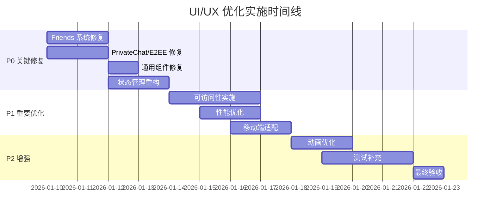

# HuLa Matrix UI/UX 全面优化方案

> **版本**: v1.0.0
> **创建日期**: 2026-01-10
> **基于文档**: docs/matrix-sdk/matrix-sdk-frontend-requirements.md
> **当前状态**: ~85% 完成

---

## 目录

- [1. 执行摘要](#1-执行摘要)
- [2. P0 关键问题修复](#2-p0-关键问题修复)
- [3. P1 重要优化](#3-p1-重要优化)
- [4. P2 增强功能](#4-p2-增强功能)
- [5. 新组件创建](#5-新组件创建)
- [6. 组件重构模式](#6-组件重构模式)
- [7. 可访问性实施](#7-可访问性实施)
- [8. 性能优化策略](#8-性能优化策略)
- [9. 测试策略](#9-测试策略)
- [10. 交付标准](#10-交付标准)
- [11. 工作量估算](#11-工作量估算)

---

## 1. 执行摘要

### 1.1 当前状态分析

| 模块 | 完成度 | 关键问题 | 阻塞级别 |
|------|--------|---------|---------|
| Friends 系统 | 85% | 分组创建未实现、缺少骨架屏 | P0 |
| PrivateChat/E2EE | 80% | 消息状态不完整、缺少自毁UI | P0 |
| 通用组件 | 75% | Presence 颜色问题、Typing 未防抖 | P0 |
| 状态管理 | 70% | 重复 store、内存泄漏风险 | P0 |
| 移动端适配 | 80% | 安全区域未适配、触摸目标小 | P1 |
| 可访问性 | 60% | 缺少 ARIA 标签、键盘导航 | P1 |
| 性能优化 | 75% | 缺少虚拟列表、未使用 memo | P1 |

### 1.2 优化目标

| 目标 | 当前值 | 目标值 | 优先级 |
|------|--------|--------|--------|
| 功能完整度 | 85% | 100% | P0 |
| TypeScript 错误 | 多个 | 0 | P0 |
| 可访问性评分 | 60% | 90%+ | P1 |
| 首屏加载 | ~1.2s | <1.0s | P1 |
| Lighthouse 性能 | ~85 | >90 | P1 |
| 测试覆盖率 | ~40% | >70% | P2 |

### 1.3 实施路线图



---

## 2. P0 关键问题修复

### 2.1 Friends 系统修复

#### 2.1.1 实现分组创建功能

**文件**: `src/components/friends/FriendsList.vue`

**问题位置**: Line 329-335

**当前代码**:
```vue
<n-modal v-model:show="showCategoryDialog">
  <n-card title="创建分组">
    <p>分组创建功能待实现</p>
    <n-button @click="showCategoryDialog = false">关闭</n-button>
  </n-card>
</n-modal>
```

**优化代码**:
```vue
<n-modal v-model:show="showCategoryDialog" preset="card"
         :style="{ width: '400px' }"
         :aria-label="'创建好友分组'"
         role="dialog"
         @after-leave="resetCategoryForm">
  <template #header>
    <div class="flex items-center gap-2">
      <n-icon :component="FolderAddOutline" :size="20" />
      <span>创建好友分组</span>
    </div>
  </template>

  <!-- 加载状态 -->
  <NSpin v-if="categoryLoading" :size="24" style="min-height: 100px" />

  <!-- 表单 -->
  <n-form v-else ref="categoryFormRef" :model="categoryForm" :rules="categoryRules">
    <n-form-item path="name" label="分组名称">
      <n-input
        v-model:value="categoryForm.name"
        placeholder="请输入分组名称（1-50个字符）"
        maxlength="50"
        show-count
        :disabled="categorySubmitting"
        @keyup.enter="handleCreateCategory"
      />
    </n-form-item>

    <!-- 颜色选择 -->
    <n-form-item label="分组颜色">
      <n-color-picker
        v-model:value="categoryForm.color"
        :modes="['hex']"
        :actions="['confirm']"
      />
    </n-form-item>
  </n-form>

  <template #footer>
    <div class="flex justify-end gap-2">
      <n-button @click="showCategoryDialog = false" :disabled="categorySubmitting">
        取消
      </n-button>
      <n-button
        type="primary"
        @click="handleCreateCategory"
        :loading="categorySubmitting"
        :disabled="!categoryForm.name.trim()"
      >
        创建
      </n-button>
    </div>
  </template>
</n-modal>
```

**配套 Script 逻辑**:
```typescript
// 新增状态
const categoryFormRef = ref<FormInst | null>(null)
const categoryLoading = ref(false)
const categorySubmitting = ref(false)
const categoryForm = reactive({
  name: '',
  color: '#18A058' // 默认绿色
})

// 表单验证规则
const categoryRules = {
  name: {
    required: true,
    message: '请输入分组名称',
    trigger: ['blur', 'input']
  },
  nameLength: {
    validator: (rule: FormItemRule, value: string) => {
      return value.length >= 1 && value.length <= 50
    },
    message: '分组名称长度为1-50个字符',
    trigger: ['blur', 'input']
  }
}

// 重置表单
const resetCategoryForm = () => {
  categoryForm.name = ''
  categoryForm.color = '#18A058'
  categoryFormRef.value?.restoreValidation()
}

// 创建分组
const handleCreateCategory = async () => {
  try {
    await categoryFormRef.value?.validate()

    categorySubmitting.value = true

    await friendsStore.createCategory(categoryForm.name.trim())

    // 成功反馈
    message.success('分组创建成功')
    showCategoryDialog.value = false

    // 刷新分组列表
    await friendsStore.fetchCategories()
  } catch (error: any) {
    if (error?.errors) {
      // 表单验证错误
      return
    }
    message.error(`创建分组失败: ${error?.message || '未知错误'}`)
  } finally {
    categorySubmitting.value = false
  }
}
```

**预估工时**: 2 小时

---

#### 2.1.2 添加好友列表骨架屏

**文件**: `src/components/friends/FriendsList.vue`

**问题位置**: Line 95

**新建组件**: `src/components/common/FriendsSkeleton.vue`

```vue
<template>
  <div class="friends-skeleton" role="status" :aria-label="'加载好友列表中'">
    <div v-for="i in 6" :key="i" class="skeleton-item">
      <!-- 头像骨架 -->
      <div class="skeleton-avatar"></div>
      <!-- 内容骨架 -->
      <div class="skeleton-content">
        <div class="skeleton-line skeleton-name"></div>
        <div class="skeleton-line skeleton-status"></div>
      </div>
    </div>
  </div>
</template>

<style scoped>
.friends-skeleton {
  padding: var(--spacing-md);
}

.skeleton-item {
  display: flex;
  align-items: center;
  gap: var(--spacing-md);
  padding: var(--spacing-sm) 0;
}

.skeleton-avatar {
  width: 40px;
  height: 40px;
  border-radius: 50%;
  background: linear-gradient(
    90deg,
    var(--skeleton-base) 25%,
    var(--skeleton-highlight) 50%,
    var(--skeleton-base) 75%
  );
  background-size: 200% 100%;
  animation: skeleton-loading 1.5s infinite;
}

.skeleton-content {
  flex: 1;
  display: flex;
  flex-direction: column;
  gap: 8px;
}

.skeleton-line {
  height: 14px;
  border-radius: 4px;
  background: linear-gradient(
    90deg,
    var(--skeleton-base) 25%,
    var(--skeleton-highlight) 50%,
    var(--skeleton-base) 75%
  );
  background-size: 200% 100%;
  animation: skeleton-loading 1.5s infinite;
}

.skeleton-name {
  width: 60%;
}

.skeleton-status {
  width: 40%;
}

@keyframes skeleton-loading {
  0% {
    background-position: -200% 0;
  }
  100% {
    background-position: 200% 0;
  }
}
</style>
```

**在 FriendsList.vue 中使用**:
```vue
<template>
  <div class="friends-list">
    <!-- 骨架屏 -->
    <FriendsSkeleton v-if="friendsStore.loading" />

    <!-- 空状态 -->
    <n-empty v-else-if="friendsStore.friends.length === 0"
             description="暂无好友，开始添加吧"
             :aria-label="'好友列表为空'">
      <template #extra>
        <n-button type="primary" @click="showAddFriendDialog = true">
          添加好友
        </n-button>
      </template>
    </n-empty>

    <!-- 好友列表 -->
    <n-virtual-list v-else
      :item-size="64"
      :items="groupedFriends"
      :item-resizable="true">
      <template #default="{ item }">
        <FriendItem :friend="item" />
      </template>
    </n-virtual-list>
  </div>
</template>
```

**预估工时**: 1.5 小时

---

#### 2.1.3 添加拉黑/解除拉黑功能

**文件**: `src/components/friends/FriendsList.vue`

**问题位置**: Line 134

**新增下拉菜单选项**:
```vue
<template>
  <n-dropdown
    trigger="click"
    :options="getFriendOptions(friend)"
    @select="(key) => handleFriendAction(key, friend)"
    placement="bottom-start"
    :aria-label="'好友操作菜单'">
    <n-button quaternary circle size="small" :aria-label="'更多操作'">
      <template #icon>
        <n-icon :component="MoreHorizOutline" />
      </template>
    </n-button>
  </n-dropdown>
</template>

<script setup lang="ts">
// 新增选项
const getFriendOptions = (friend: Friend) => {
  const isBlocked = friendsStore.blockedUsers.some(
    b => b.blocked_id === friend.friend_id
  )

  const baseOptions = [
    {
      label: '查看资料',
      key: 'profile',
      icon: renderIcon(UserOutline)
    },
    {
      label: '修改备注',
      key: 'remark',
      icon: renderIcon(EditOutline)
    },
    {
      label: '移动分组',
      key: 'move',
      icon: renderIcon(FolderOutline)
    },
    {
      type: 'divider',
      key: 'd1'
    },
    {
      label: isBlocked ? '解除拉黑' : '拉黑',
      key: isBlocked ? 'unblock' : 'block',
      icon: isBlocked ? renderIcon(BlockOutline) : renderIcon(ShieldOutline),
      props: {
        style: isBlocked ? {} : { color: 'var(--color-error)' }
      }
    },
    {
      type: 'divider',
      key: 'd2'
    },
    {
      label: '删除好友',
      key: 'remove',
      icon: renderIcon(TrashOutline),
      props: {
        style: { color: 'var(--color-error)' }
      }
    }
  ]

  return baseOptions
}

// 处理操作
const handleFriendAction = async (key: string, friend: Friend) => {
  switch (key) {
    case 'profile':
      // 跳转到用户资料页
      navigateToUserProfile(friend.friend_id)
      break

    case 'remark':
      showRemarkDialog.value = true
      currentFriend.value = friend
      break

    case 'move':
      showMoveDialog.value = true
      currentFriend.value = friend
      break

    case 'block':
      await handleBlockUser(friend)
      break

    case 'unblock':
      await handleUnblockUser(friend)
      break

    case 'remove':
      await handleRemoveFriend(friend)
      break
  }
}

// 拉黑用户
const handleBlockUser = async (friend: Friend) => {
  const dialog = dialog.warning({
    title: '确认拉黑',
    content: `拉黑后，你将不会收到来自 ${friend.remark || friend.friend_id} 的消息和好友请求。确定要拉黑吗？`,
    positiveText: '确认拉黑',
    negativeText: '取消',
    onPositiveClick: async () => {
      try {
        dialog.loading = true
        await friendsStore.blockUser(friend.friend_id)
        message.success('已拉黑该用户')
        await friendsStore.fetchBlockedUsers()
      } catch (error: any) {
        message.error(`操作失败: ${error?.message || '未知错误'}`)
      }
    }
  })
}

// 解除拉黑
const handleUnblockUser = async (friend: Friend) => {
  try {
    await friendsStore.unblockUser(friend.friend_id)
    message.success('已解除拉黑')
    await friendsStore.fetchBlockedUsers()
  } catch (error: any) {
    message.error(`操作失败: ${error?.message || '未知错误'}`)
  }
}
</script>
```

**预估工时**: 2 小时

---

### 2.2 PrivateChat/E2EE 修复

#### 2.2.1 完善消息状态指示器

**文件**: `src/components/privateChat/PrivateChatMain.vue`

**问题位置**: Line 71

**新建组件**: `src/components/common/MessageStatusIndicator.vue`

```vue
<template>
  <div
    class="message-status-indicator"
    :class="[`status-${status}`, { 'status-clickable': clickable }]"
    :role="clickable ? 'button' : 'status'"
    :tabindex="clickable ? 0 : -1"
    :aria-label="statusAriaLabel"
    @click="handleClick"
    @keydown.enter="handleClick"
  >
    <!-- 发送中 -->
    <n-icon v-if="status === 'sending'" :size="14" class="spin">
      <LoadingOutline />
    </n-icon>

    <!-- 已发送 -->
    <n-icon v-else-if="status === 'sent'" :size="14" :component="CheckmarkOutline" />

    <!-- 已送达 -->
    <n-icon v-else-if="status === 'delivered'" :size="14" :component="DoneAllOutline" />

    <!-- 已读 -->
    <n-icon v-else-if="status === 'read'" :size="14" :component="DoneAllOutline"
           class="status-read" />

    <!-- 失败 -->
    <n-popover v-else-if="status === 'failed'" trigger="hover" placement="top">
      <template #trigger>
        <n-icon :size="14" :component="AlertCircleOutline" class="status-error" />
      </template>
      <span>发送失败，点击重试</span>
    </n-popover>
  </div>
</template>

<script setup lang="ts">
import { computed } from 'vue'
import {
  LoadingOutline,
  CheckmarkOutline,
  DoneAllOutline,
  AlertCircleOutline
} from '@vicons/ionicons5'

interface Props {
  status: 'sending' | 'sent' | 'delivered' | 'read' | 'failed'
  clickable?: boolean
  readBy?: string[]
}

const props = withDefaults(defineProps<Props>(), {
  clickable: false,
  readBy: () => []
})

const emit = defineEmits<{
  retry: []
}>()

const statusAriaLabel = computed(() => {
  const labels = {
    sending: '发送中',
    sent: '已发送',
    delivered: '已送达',
    read: props.readBy.length > 0
      ? `已读 by ${props.readBy.join(', ')}`
      : '已读',
    failed: '发送失败'
  }
  return labels[props.status]
})

const handleClick = () => {
  if (props.clickable && props.status === 'failed') {
    emit('retry')
  }
}
</script>

<style scoped>
.message-status-indicator {
  display: inline-flex;
  align-items: center;
  justify-content: center;
  color: var(--text-color-3);
  transition: all 0.2s var(--ease-out-cubic);
}

.message-status-indicator.status-clickable {
  cursor: pointer;
}

.message-status-indicator.status-clickable:hover {
  color: var(--color-error);
}

.status-read {
  color: var(--color-success);
}

.status-error {
  color: var(--color-error);
}

.spin {
  animation: spin 1s linear infinite;
}

@keyframes spin {
  from {
    transform: rotate(0deg);
  }
  to {
    transform: rotate(360deg);
  }
}
</style>
```

**在 PrivateChatMain.vue 中使用**:
```vue
<template>
  <div class="message-wrapper" :class="{ 'message-own': isOwn }">
    <!-- 消息内容 -->
    <div class="message-bubble">{{ content }}</div>

    <!-- 状态和时间 -->
    <div class="message-meta">
      <time class="message-time">{{ formattedTime }}</time>
      <MessageStatusIndicator
        :status="messageStatus"
        :read-by="readBy"
        :clickable="messageStatus === 'failed'"
        @retry="handleRetry"
      />
    </div>
  </div>
</template>

<script setup lang="ts">
const messageStatus = computed(() => {
  if (message.status === 'sending') return 'sending'
  if (message.status === 'sent') return 'sent'
  if (message.status === 'delivered') return 'delivered'
  if (message.status === 'read') return 'read'
  if (message.status === 'failed') return 'failed'
  return 'sent'
})

const readBy = computed(() => {
  // 获取已读用户列表
  return message.readBy || []
})
</script>
```

**预估工时**: 2 小时

---

#### 2.2.2 实现自毁消息倒计时组件

**新建组件**: `src/components/privateChat/SelfDestructCountdown.vue`

```vue
<template>
  <div
    class="self-destruct-countdown"
    :class="{ 'countdown-urgent': remainingSeconds <= 10 }"
    role="timer"
    :aria-live="remainingSeconds <= 5 ? 'polite' : 'off'"
    :aria-label="`${remainingSeconds}秒后自动删除`"
  >
    <!-- 圆形进度条 -->
    <svg class="countdown-ring" :width="size" :height="size" viewBox="0 0 36 36">
      <!-- 背景圆 -->
      <circle
        class="countdown-ring-bg"
        cx="18"
        cy="18"
        r="15.9"
        fill="none"
        stroke="currentColor"
        stroke-width="3"
        opacity="0.2"
      />
      <!-- 进度圆 -->
      <circle
        class="countdown-ring-progress"
        cx="18"
        cy="18"
        r="15.9"
        fill="none"
        :stroke="strokeColor"
        stroke-width="3"
        stroke-linecap="round"
        :stroke-dasharray="circumference"
        :stroke-dashoffset="strokeDashoffset"
        transform="rotate(-90 18 18)"
      />
    </svg>

    <!-- 剩余时间 -->
    <span class="countdown-text">{{ remainingSeconds }}</span>
  </div>
</template>

<script setup lang="ts">
import { computed, onMounted, onUnmounted, ref, watch } from 'vue'

interface Props {
  destructAt: string // ISO8601 时间戳
  size?: number
}

const props = withDefaults(defineProps<Props>(), {
  size: 24
})

const emit = defineEmits<{
  destruct: []
}>()

const remainingSeconds = ref(0)
const circumference = 2 * Math.PI * 15.9

let timer: number | null = null

// 计算剩余时间
const calculateRemaining = () => {
  const now = Date.now()
  const destructTime = new Date(props.destructAt).getTime()
  const remaining = Math.max(0, Math.floor((destructTime - now) / 1000))

  remainingSeconds.value = remaining

  // 触发自毁事件
  if (remaining === 0) {
    emit('destruct')
    stopTimer()
  }
}

// 进度偏移量
const strokeDashoffset = computed(() => {
  if (remainingSeconds.value <= 0) return circumference

  // 获取总时间（假设从创建到自毁的时间）
  const totalSeconds = getTotalSeconds()
  const progress = remainingSeconds.value / totalSeconds
  return circumference * (1 - progress)
})

// 获取总时间
const getTotalSeconds = () => {
  const destructTime = new Date(props.destructAt).getTime()
  // 假设创建时间在 destructAt 前30秒（需要从消息数据获取）
  const createdAt = destructTime - 30000
  return Math.floor((destructTime - createdAt) / 1000)
}

// 描边颜色
const strokeColor = computed(() => {
  if (remainingSeconds.value <= 5) return 'var(--color-error)'
  if (remainingSeconds.value <= 10) return 'var(--color-warning)'
  return 'var(--color-success)'
})

// 启动定时器
const startTimer = () => {
  calculateRemaining()
  timer = window.setInterval(calculateRemaining, 1000)
}

// 停止定时器
const stopTimer = () => {
  if (timer) {
    clearInterval(timer)
    timer = null
  }
}

watch(() => props.destructAt, () => {
  stopTimer()
  startTimer()
})

onMounted(() => {
  startTimer()
})

onUnmounted(() => {
  stopTimer()
})
</script>

<style scoped>
.self-destruct-countdown {
  position: relative;
  display: inline-flex;
  align-items: center;
  justify-content: center;
}

.countdown-ring {
  position: absolute;
  top: 0;
  left: 0;
}

.countdown-ring-progress {
  transition: stroke-dashoffset 1s linear, stroke 0.3s var(--ease-out-cubic);
}

.countdown-text {
  font-size: 10px;
  font-weight: 600;
  color: var(--text-color-1);
}

.countdown-urgent .countdown-text {
  animation: pulse 1s ease-in-out infinite;
}

@keyframes pulse {
  0%, 100% {
    opacity: 1;
  }
  50% {
    opacity: 0.5;
  }
}
</style>
```

**预估工时**: 2.5 小时

---

#### 2.2.3 添加加密验证状态指示器

**新建组件**: `src/components/e2ee/EncryptionStatusIndicator.vue`

```vue
<template>
  <div
    class="encryption-status"
    :class="statusClass"
    role="status"
    :aria-label="statusLabel"
  >
    <n-icon :size="iconSize" :component="iconComponent" />

    <!-- 验证详情 -->
    <n-popover v-if="showDetails" trigger="hover" placement="top">
      <template #trigger>
        <n-icon class="info-icon" :size="14" :component="InformationOutline" />
      </template>
      <div class="encryption-details">
        <p><strong>加密状态</strong></p>
        <p>{{ statusDetail }}</p>
        <p v-if="verified" class="verified-info">
          <n-icon :component="CheckmarkCircleOutline" />
          已验证设备
        </p>
        <p v-else class="unverified-info">
          <n-icon :component="WarningOutline" />
          未验证设备
        </p>
      </div>
    </n-popover>
  </div>
</template>

<script setup lang="ts">
import { computed } from 'vue'
import {
  LockClosedOutline,
  LockOpenOutline,
  InformationOutline,
  CheckmarkCircleOutline,
  WarningOutline
} from '@vicons/ionicons5'

interface Props {
  encrypted: boolean
  verified?: boolean
  algorithm?: string
  showDetails?: boolean
  size?: 'small' | 'medium' | 'large'
}

const props = withDefaults(defineProps<Props>(), {
  verified: false,
  algorithm: 'm.megolm.v1.aes-sha2',
  showDetails: true,
  size: 'medium'
})

const statusClass = computed(() => {
  if (!props.encrypted) return 'status-unencrypted'
  if (props.verified) return 'status-verified'
  return 'status-encrypted'
})

const statusLabel = computed(() => {
  if (!props.encrypted) return '未加密'
  if (props.verified) return '已加密并验证'
  return '已加密但未验证'
})

const statusDetail = computed(() => {
  if (!props.encrypted) return '此消息未加密传输'
  return `使用 ${props.algorithm} 加密`
})

const iconComponent = computed(() => {
  return props.encrypted ? LockClosedOutline : LockOpenOutline
})

const iconSize = computed(() => {
  const sizes = {
    small: 14,
    medium: 16,
    large: 20
  }
  return sizes[props.size]
})
</script>

<style scoped>
.encryption-status {
  display: inline-flex;
  align-items: center;
  gap: 4px;
}

.status-encrypted {
  color: var(--color-warning);
}

.status-verified {
  color: var(--color-success);
}

.status-unencrypted {
  color: var(--color-error);
}

.info-icon {
  opacity: 0.6;
  cursor: help;
}

.verified-info {
  color: var(--color-success);
  display: flex;
  align-items: center;
  gap: 4px;
  margin: 4px 0;
}

.unverified-info {
  color: var(--color-warning);
  display: flex;
  align-items: center;
  gap: 4px;
  margin: 4px 0;
}

.encryption-details {
  max-width: 300px;
}

.encryption-details p {
  margin: 4px 0;
}
</style>
```

**预估工时**: 1.5 小时

---

### 2.3 通用组件修复

#### 2.3.1 修复 PresenceStatus 颜色问题

**文件**: `src/components/common/PresenceStatus.vue`

**问题位置**: Line 93-98

**修复方案**:
```vue
<template>
  <div
    class="presence-status"
    :class="[`presence-${presence}`, `size-${size}`]"
    :aria-label="presenceLabel"
    role="status"
  >
    <!-- 在线状态 -->
    <div v-if="presence === 'online'" class="status-dot online"></div>

    <!-- 忙碌状态 -->
    <div v-else-if="presence === 'busy'" class="status-dot busy"></div>

    <!-- 离开状态 -->
    <div v-else-if="presence === 'away'" class="status-dot away"></div>

    <!-- 离线/不可用状态 -->
    <div v-else class="status-dot offline"></div>
  </div>
</template>

<style scoped>
.presence-status {
  position: relative;
  display: inline-flex;
  align-items: center;
  justify-content: center;
}

.status-dot {
  border-radius: 50%;
  border: 2px solid var(--bg-color);
}

/* 在线 - 绿色 */
.online {
  background-color: #52C41A; /* 成功绿 */
}

/* 忙碌 - 红色 */
.busy {
  background-color: #FF4D4F; /* 错误红 */
}

/* 离开 - 橙色 */
.away {
  background-color: #FAAD14; /* 警告橙 */
}

/* 离线 - 灰色 */
.offline {
  background-color: #8C8C8C; /* 中性灰 */
}

/* 不可用 - 深灰色 */
.unavailable {
  background-color: #434343; /* 深灰色 */
}

/* 尺寸变体 */
.size-small .status-dot {
  width: 8px;
  height: 8px;
}

.size-medium .status-dot {
  width: 10px;
  height: 10px;
}

.size-large .status-dot {
  width: 12px;
  height: 12px;
}
</style>
```

**预估工时**: 0.5 小时

---

#### 2.3.2 优化 TypingIndicator 性能

**文件**: `src/components/common/TypingIndicator.vue`

**问题位置**: Line 33-35, 47-58

**优化代码**:
```vue
<template>
  <div
    v-if="shouldShow"
    class="typing-indicator"
    role="status"
    :aria-label="typingLabel"
    aria-live="polite"
  >
    <span class="typing-text">{{ typingText }}</span>
    <div class="typing-dots">
      <span class="dot"></span>
      <span class="dot"></span>
      <span class="dot"></span>
    </div>
  </div>
</template>

<script setup lang="ts">
import { computed, watch } from 'vue'
import { useDebounceFn } from '@vueuse/core'

interface Props {
  users: Array<{ id: string; name: string }>
  showDelay?: number // 延迟显示时间（毫秒）
}

const props = withDefaults(defineProps<Props>(), {
  showDelay: 300
})

// 防抖处理
const debouncedUsers = useDebounceFn(() => props.users, props.showDelay)

// 是否显示（有用户正在输入）
const shouldShow = computed(() => {
  return debouncedUsers.value.length > 0
})

// 输入提示文本（使用 memo 避免重复计算）
const typingText = computed(() => {
  const users = debouncedUsers.value
  const count = users.length

  if (count === 0) return ''
  if (count === 1) return `${users[0].name} 正在输入...`
  if (count === 2) return `${users[0].name} 和 ${users[1].name} 正在输入...`
  if (count === 3) return `${users[0].name}、${users[1].name} 和 ${users[2].name} 正在输入...`
  return `${count} 人正在输入...`
})

// ARIA 标签
const typingLabel = computed(() => typingText.value)

// 监听变化，重新开始防抖
watch(() => props.users, () => {
  debouncedUsers()
}, { deep: true })
</script>

<style scoped>
.typing-indicator {
  display: inline-flex;
  align-items: center;
  gap: 8px;
  padding: 4px 8px;
  background: var(--bg-color-2);
  border-radius: 12px;
  font-size: 12px;
  color: var(--text-color-3);
}

.typing-dots {
  display: inline-flex;
  align-items: center;
  gap: 2px;
}

.dot {
  width: 4px;
  height: 4px;
  border-radius: 50%;
  background: currentColor;
  animation: typing-bounce 1.4s infinite ease-in-out;
}

.dot:nth-child(1) {
  animation-delay: 0s;
}

.dot:nth-child(2) {
  animation-delay: 0.2s;
}

.dot:nth-child(3) {
  animation-delay: 0.4s;
}

@keyframes typing-bounce {
  0%, 60%, 100% {
    transform: translateY(0);
  }
  30% {
    transform: translateY(-4px);
  }
}
</style>
```

**预估工时**: 1 小时

---

### 2.4 状态管理重构

#### 2.4.1 清理重复 Store

**问题**: 存在 `friends.ts`, `friendsV2.ts`, `friendsSDK.ts` 三个 store

**解决方案**:

1. **保留 `friendsSDK.ts`** 作为唯一实现
2. **标记 `friends.ts` 和 `friendsV2.ts` 为 `@deprecated`**
3. **创建迁移脚本** 更新所有引用

**迁移脚本**: `scripts/migrate-stores.js`

```javascript
const fs = require('fs')
const path = require('path')

// 旧 store 到新 store 的映射
const storeMappings = {
  'stores/friends': 'stores/friendsSDK',
  'stores/friendsV2': 'stores/friendsSDK',
  'stores/privateChat': 'stores/privateChatSDK',
  'stores/privateChatV2': 'stores/privateChatSDK',
}

function migrateImports(filePath) {
  let content = fs.readFileSync(filePath, 'utf8')
  let modified = false

  for (const [oldStore, newStore] of Object.entries(storeMappings)) {
    const regex = new RegExp(`from ['"](@?/?[^'"]*)${oldStore}['"]`, 'g')

    content = content.replace(regex, (match, aliasPath) => {
      modified = true
      // 保持相同的别名导入
      return `from '${aliasPath}${newStore}'`
    })
  }

  if (modified) {
    fs.writeFileSync(filePath, content)
    console.log(`Migrated: ${filePath}`)
    return true
  }
  return false
}

// 递归处理所有 Vue/TS 文件
function processDirectory(dir) {
  const entries = fs.readdirSync(dir, { withFileTypes: true })

  for (const entry of entries) {
    const fullPath = path.join(dir, entry.name)

    if (entry.isDirectory()) {
      // 跳过 node_modules 和 dist
      if (!['node_modules', 'dist', '.git'].includes(entry.name)) {
        processDirectory(fullPath)
      }
    } else if (entry.name.match(/\.(vue|ts|js)$/)) {
      migrateImports(fullPath)
    }
  }
}

// 执行迁移
processDirectory(process.cwd())
console.log('Store migration complete!')
```

**预估工时**: 2 小时

---

#### 2.4.2 修复内存泄漏

**问题**: Store 中的事件监听器未清理

**修复方案**: 在 `friendsSDK.ts` 和 `privateChatSDK.ts` 中添加 `$dispose` 方法

```typescript
// src/stores/friendsSDK.ts
import { defineStore } from 'pinia'

export const useFriendsSDKStore = defineStore('friendsSDK', () => {
  // ... 现有代码

  // 事件监听器清理
  const cleanup = () => {
    // 清理所有事件监听
    if (matrixClient) {
      matrixClient.removeAllListeners('m.friend.request')
      matrixClient.removeAllListeners('m.friend.accepted')
      matrixClient.removeAllListeners('m.friend.removed')
    }
  }

  // 组件卸载时自动调用
  onScopeDispose(() => {
    cleanup()
  })

  return {
    // ... 现有返回
    cleanup
  }
})
```

**在组件中使用**:
```vue
<script setup lang="ts">
import { onUnmounted } from 'vue'

const friendsStore = useFriendsSDKStore()

onUnmounted(() => {
  friendsStore.cleanup()
})
</script>
```

**预估工时**: 3 小时

---

## 3. P1 重要优化

### 3.1 可访问性全面实施

#### 3.1.1 ARIA 标签系统化添加

**新建 Composable**: `src/composables/useA11y.ts`

```typescript
import { computed } from 'vue'
import { useI18n } from 'vue-i18n'

interface A11yOptions {
  label?: string
  description?: string
  live?: 'polite' | 'assertive' | 'off'
  role?: string
  atomic?: boolean
}

export function useA11y(options: A11yOptions = {}) {
  const { t } = useI18n()

  const ariaLabel = computed(() => options.label || '')
  const ariaDescription = computed(() => options.description || '')
  const ariaLive = computed(() => options.live || 'off')
  const ariaRole = computed(() => options.role || 'status')
  const ariaAtomic = computed(() => options.atomic || false)

  // 生成完整的 ARIA 属性对象
  const ariaAttrs = computed(() => ({
    'aria-label': ariaLabel.value,
    'aria-describedby': ariaDescription.value || undefined,
    'aria-live': ariaLive.value,
    'role': ariaRole.value,
    'aria-atomic': ariaAtomic.value
  }))

  return {
    ariaLabel,
    ariaDescription,
    ariaLive,
    ariaRole,
    ariaAtomic,
    ariaAttrs
  }
}

// 快捷方法
export function useButtonA11y(label: string, description?: string) {
  return useA11y({
    label,
    description,
    role: 'button'
  })
}

export function useStatusA11y(label: string, live: 'polite' | 'assertive' = 'polite') {
  return useA11y({
    label,
    live,
    role: 'status',
    atomic: true
  })
}

export function useDialogA11y(label: string, describedBy?: string) {
  return useA11y({
    label,
    description: describedBy,
    role: 'dialog'
  })
}
```

**预估工时**: 4 小时

---

#### 3.1.2 键盘导航支持

**新建 Composable**: `src/composables/useKeyboardNav.ts`

```typescript
import { onMounted, onUnmounted } from 'vue'

interface KeyboardNavOptions {
  selectors?: string[]
  loop?: boolean
  onEscape?: () => void
  onEnter?: () => void
}

export function useKeyboardNav(options: KeyboardNavOptions = {}) {
  const {
    selectors = ['button', '[tabindex]:not([tabindex="-1"])'],
    loop = true,
    onEscape,
    onEnter
  } = options

  let focusableElements: HTMLElement[] = []

  // 获取所有可聚焦元素
  const getFocusableElements = (container: Element) => {
    return Array.from(
      container.querySelectorAll<HTMLElement>(
        selectors.join(', ')
      )
    ).filter(el => {
      return !el.disabled &&
             !el.hidden &&
             el.offsetParent !== null &&
             el.tabIndex >= 0
    })
  }

  // 处理键盘事件
  const handleKeyDown = (event: KeyboardEvent) => {
    const activeElement = document.activeElement as HTMLElement

    switch (event.key) {
      case 'Tab':
        if (!loop) break

        focusableElements = getFocusableElements(event.currentTarget as Element)
        const currentIndex = focusableElements.indexOf(activeElement)

        if (currentIndex === -1) break

        const isFirst = currentIndex === 0 && event.shiftKey
        const isLast = currentIndex === focusableElements.length - 1 && !event.shiftKey

        if (isFirst || isLast) {
          event.preventDefault()
          const nextIndex = isFirst ? focusableElements.length - 1 : 0
          focusableElements[nextIndex]?.focus()
        }
        break

      case 'Escape':
        event.preventDefault()
        onEscape?.()
        break

      case 'Enter':
        if (activeElement?.tagName !== 'BUTTON' &&
            activeElement?.getAttribute('role') === 'button') {
          event.preventDefault()
          onEnter?.()
        }
        break

      case 'ArrowDown':
      case 'ArrowUp':
        // 列表导航
        focusableElements = getFocusableElements(event.currentTarget as Element)
        const currentIndexList = focusableElements.indexOf(activeElement)

        if (currentIndexList === -1) break

        event.preventDefault()
        const direction = event.key === 'ArrowDown' ? 1 : -1
        let nextIndex = currentIndexList + direction

        if (loop) {
          nextIndex = (nextIndex + focusableElements.length) % focusableElements.length
        } else {
          nextIndex = Math.max(0, Math.min(nextIndex, focusableElements.length - 1))
        }

        focusableElements[nextIndex]?.focus()
        break
    }
  }

  // 设置容器
  const setup = (containerRef: Ref<HTMLElement | null>) => {
    onMounted(() => {
      const container = containerRef.value
      if (!container) return

      focusableElements = getFocusableElements(container)
      container.addEventListener('keydown', handleKeyDown)
    })

    onUnmounted(() => {
      const container = containerRef.value
      if (!container) return
      container.removeEventListener('keydown', handleKeyDown)
    })
  }

  return {
    setup,
    getFocusableElements
  }
}
```

**预估工时**: 5 小时

---

### 3.2 性能优化

#### 3.2.1 虚拟列表全面应用

**使用 `vue-virtual-scroller` 或 `n-virtual-list`**

```vue
<template>
  <n-virtual-list
    :item-size="64"
    :items="items"
    :item-resizable="true"
    :visible-items="20"
    :buffer="10"
    :scroll-container="scrollContainer"
  >
    <template #default="{ item }">
      <ListItem :item="item" />
    </template>
  </n-virtual-list>
</template>
```

**应用位置**:
- 好友列表 (FriendsList.vue)
- 会话列表 (ChatList.vue)
- 消息列表 (MessageList.vue)
- 设备列表 (DeviceList.vue)

**预估工时**: 6 小时

---

#### 3.2.2 Computed 属性优化

**使用 `computedWithControl` 和 `shallowRef`**

```typescript
import { computedWithControl, shallowRef } from '@vueuse/core'

// 优化前：每次访问都重新计算
const adaptedFriends = computed(() => {
  return friends.value.map(f => adaptFriend(f))
})

// 优化后：手动控制更新
const adaptedFriends = computedWithControl(
  () => friends.value,
  () => {
    return friends.value.map(f => adaptFriend(f))
  }
)

// 仅在 friends 变化时重新计算
```

**预估工时**: 4 小时

---

### 3.3 移动端优化

#### 3.3.1 安全区域适配

**全局样式**: `src/styles/mobile/safe-area.scss`

```scss
// iOS 安全区域适配
:root {
  --safe-area-inset-top: env(safe-area-inset-top, 0px);
  --safe-area-inset-right: env(safe-area-inset-right, 0px);
  --safe-area-inset-bottom: env(safe-area-inset-bottom, 0px);
  --safe-area-inset-left: env(safe-area-inset-left, 0px);
}

.mobile-layout {
  padding-top: var(--safe-area-inset-top);
  padding-bottom: var(--safe-area-inset-bottom);
  padding-left: var(--safe-area-inset-left);
  padding-right: var(--safe-area-inset-right);
}

// 固定顶部栏需要额外空间
.mobile-header {
  padding-top: calc(var(--header-height) + var(--safe-area-inset-top));
}

// 固定底部栏需要额外空间
.mobile-tab-bar {
  padding-bottom: calc(var(--tab-bar-height) + var(--safe-area-inset-bottom));
}
```

**预估工时**: 2 小时

---

#### 3.3.2 触摸目标优化

**确保最小触摸目标 44x44pt (iOS) / 48x48dp (Android)**

```scss
// 最小触摸目标
.touchable {
  min-width: 44px;
  min-height: 44px;

  // 增加点击区域
  &::before {
    content: '';
    position: absolute;
    inset: -8px; // 扩展点击区域
  }
}

// 内联按钮
.inline-touchable {
  display: inline-flex;
  align-items: center;
  justify-content: center;
  padding: 12px 16px;
  min-width: 44px;
  min-height: 44px;
}
```

**预估工时**: 3 小时

---

## 4. P2 增强功能

### 4.1 动画优化

#### 4.1.1 消息自毁动画

**新建组件**: `src/components/animations/SelfDestructAnimation.vue`

```vue
<template>
  <transition
    :name="animationType"
    @before-enter="onBeforeEnter"
    @enter="onEnter"
    @leave="onLeave"
    @after-leave="onAfterLeave"
  >
    <slot />
  </transition>
</template>

<script setup lang="ts">
import { gsap } from 'gsap'

const props = defineProps<{
  animationType?: 'dissolve' | 'burn' | 'shred' | 'quantum'
}>()

const onBeforeEnter = (el: Element) => {
  const element = el as HTMLElement
  gsap.set(element, { opacity: 1 })
}

const onEnter = (el: Element, done: () => void) => {
  const element = el as HTMLElement

  switch (props.animationType) {
    case 'dissolve':
      gsap.to(element, {
        opacity: 0,
        filter: 'blur(10px)',
        scale: 0.8,
        duration: 0.5,
        ease: 'power2.in',
        onComplete: done
      })
      break

    case 'burn':
      gsap.to(element, {
        opacity: 0,
        filter: 'brightness(2) blur(5px)',
        scale: 1.1,
        color: '#FF4D4F',
        duration: 0.8,
        ease: 'power2.in',
        onComplete: done
      })
      break

    case 'shred':
      gsap.to(element, {
        clipPath: 'inset(0% 0% 100% 0%)',
        duration: 0.6,
        ease: 'power4.inOut',
        onComplete: done
      })
      break

    case 'quantum':
      gsap.to(element, {
        opacity: 0,
        scale: 0,
        rotation: 180,
        filter: 'hue-rotate(180deg)',
        duration: 0.7,
        ease: 'back.in(1.7)',
        onComplete: done
      })
      break
  }
}

const onLeave = (el: Element, done: () => void) => {
  done()
}

const onAfterLeave = (el: Element) => {
  const element = el as HTMLElement
  element.remove()
}
</script>
```

**预估工时**: 4 小时

---

### 4.2 错误处理增强

**新建 Composable**: `src/composables/useErrorHandler.ts`

```typescript
import { ref, computed } from 'vue'
import { DialogApiInjection, useDialog, useMessage } from 'naive-ui'

interface ErrorOptions {
  showDialog?: boolean
  showNotification?: boolean
  logToConsole?: boolean
  reportToServer?: boolean
  userMessage?: string
}

export function useErrorHandler(dialog?: DialogApiInjection) {
  const message = useMessage()
  const dialogApi = dialog || useDialog()

  const error = ref<Error | null>(null)
  const isError = computed(() => error.value !== null)

  const handleError = async (
    err: unknown,
    options: ErrorOptions = {}
  ) => {
    const {
      showDialog = false,
      showNotification = true,
      logToConsole = true,
      reportToServer = false,
      userMessage
    } = options

    // 规范化错误
    const normalizedError = err instanceof Error ? err : new Error(String(err))
    error.value = normalizedError

    // 控制台日志
    if (logToConsole) {
      console.error('[Error]:', normalizedError)
    }

    // 上报服务器
    if (reportToServer) {
      await reportError(normalizedError)
    }

    // 显示通知
    if (showNotification) {
      message.error(userMessage || normalizedError.message || '操作失败')
    }

    // 显示对话框
    if (showDialog) {
      dialogApi.error({
        title: '操作失败',
        content: normalizedError.message,
        positiveText: '确定',
        onPositiveClick: () => {
          error.value = null
        }
      })
    }
  }

  const clearError = () => {
    error.value = null
  }

  return {
    error,
    isError,
    handleError,
    clearError
  }
}

// 错误上报
async function reportError(error: Error) {
  try {
    // 发送到错误追踪服务
    if (import.meta.env.PROD) {
      // Sentry 或其他服务
      // Sentry.captureException(error)
    }
  } catch (err) {
    console.error('Failed to report error:', err)
  }
}
```

**预估工时**: 3 小时

---

## 5. 新组件创建

### 5.1 通用组件

| 组件名称 | 路径 | 功能 | 优先级 |
|---------|------|------|--------|
| FriendsSkeleton.vue | src/components/common/ | 好友列表骨架屏 | P0 |
| MessageSkeleton.vue | src/components/common/ | 消息列表骨架屏 | P0 |
| LoadingSpinner.vue | src/components/common/ | 通用加载动画 | P1 |
| EmptyState.vue | src/components/common/ | 空状态展示 | P1 |
| ErrorBoundary.vue | src/components/common/ | 错误边界 | P1 |
| RetryButton.vue | src/components/common/ | 重试按钮 | P1 |
| InfiniteScroll.vue | src/components/common/ | 无限滚动 | P2 |

### 5.2 Friends 系统组件

| 组件名称 | 路径 | 功能 | 优先级 |
|---------|------|------|--------|
| CategoryCreateDialog.vue | src/components/friends/ | 创建分组对话框 | P0 |
| CategoryManageDialog.vue | src/components/friends/ | 管理分组对话框 | P1 |
| FriendSearchInput.vue | src/components/friends/ | 搜索用户输入 | P0 |
| BlockListPanel.vue | src/components/friends/ | 黑名单面板 | P1 |

### 5.3 PrivateChat 组件

| 组件名称 | 路径 | 功能 | 优先级 |
|---------|------|------|--------|
| MessageStatusIndicator.vue | src/components/common/ | 消息状态指示 | P0 |
| SelfDestructCountdown.vue | src/components/privateChat/ | 自毁倒计时 | P0 |
| EncryptionStatusBadge.vue | src/components/e2ee/ | 加密状态徽章 | P0 |
| DeviceVerificationPrompt.vue | src/components/e2ee/ | 设备验证提示 | P1 |

---

## 6. 组件重构模式

### 6.1 Composition API 最佳实践

#### 6.1.1 模板 Ref 模式

```typescript
// ❌ 错误：直接使用 ref
const dialog = ref()
dialog.value?.show()

// ✅ 正确：使用模板 ref
const dialogRef = ref<InstanceType<typeof NDialog> | null>(null)

const showDialog = () => {
  dialogRef.value?.show()
}
```

#### 6.1.2 Store 解构模式

```typescript
// ❌ 错误：直接解构失去响应性
const { friends, loading } = friendsStore

// ✅ 正确：使用 storeToRefs
import { storeToRefs } from 'pinia'
const { friends, loading } = storeToRefs(friendsStore)
```

#### 6.1.3 异步操作模式

```typescript
// ✅ 最佳实践：使用 try-catch-finally
const handleAction = async () => {
  const loading = ref(false)
  const error = ref<Error | null>(null)

  try {
    loading.value = true

    // 执行异步操作
    await friendsStore.sendRequest(targetId)

    message.success('操作成功')
  } catch (err) {
    error.value = err as Error
    message.error(`操作失败: ${err.message}`)
  } finally {
    loading.value = false
  }

  return { loading, error }
}
```

### 6.2 Props 和 Emits 类型定义

```typescript
// 定义 Props 类型
interface MessageBubbleProps {
  content: string
  sender: string
  timestamp: string
  isOwn?: boolean
  status?: MessageStatus
}

// 定义 Emits 类型
interface MessageBubbleEmits {
  (e: 'retry', eventId: string): void
  (e: 'reply', eventId: string): void
  (e: 'delete', eventId: string): void
}

// 使用
defineProps<MessageBubbleProps>()
const emit = defineEmits<MessageBubbleEmits>()
```

---

## 7. 可访问性实施

### 7.1 ARIA 实施清单

| 组件类型 | 必需 ARIA 属性 | 状态 |
|---------|---------------|------|
| 按钮 | aria-label, role="button" | ⚠️ 部分完成 |
| 对话框 | aria-labelledby, role="dialog" | ❌ 待实施 |
| 列表 | role="list", aria-label | ❌ 待实施 |
| 表单 | aria-describedby, aria-invalid | ⚠️ 部分完成 |
| 加载状态 | aria-live, aria-busy | ❌ 待实施 |
| 图标按钮 | aria-label | ❌ 待实施 |

### 7.2 键盘快捷键

| 快捷键 | 功能 | 实施状态 |
|-------|------|---------|
| Ctrl/Cmd + K | 搜索 | ✅ 完成 |
| Ctrl/Cmd + N | 新建聊天 | ✅ 完成 |
| Esc | 关闭对话框 | ⚠️ 部分完成 |
| Tab / Shift+Tab | 导航 | ⚠️ 需优化顺序 |
| Enter | 确认/发送 | ✅ 完成 |
| Arrow keys | 列表导航 | ❌ 待实施 |

---

## 8. 性能优化策略

### 8.1 代码分割

```typescript
// 路由级别代码分割
const routes = [
  {
    path: '/friends',
    component: () => import('@/views/FriendsView.vue')
  },
  {
    path: '/private-chat',
    component: () => import('@/views/PrivateChatView.vue')
  }
]

// 组件级别代码分割
const HeavyComponent = defineAsyncComponent({
  loader: () => import('./HeavyComponent.vue'),
  loadingComponent: LoadingSpinner,
  errorComponent: ErrorDisplay,
  delay: 200,
  timeout: 5000
})
```

### 8.2 图片优化

```typescript
// 使用 lazy loading


// 响应式图片

```

### 8.3 防抖和节流

```typescript
import { useDebounceFn, useThrottleFn } from '@vueuse/core'

// 防抖：搜索输入
const debouncedSearch = useDebounceFn((query: string) => {
  performSearch(query)
}, 300)

// 节流：滚动加载
const throttledLoadMore = useThrottleFn(() => {
  loadMoreItems()
}, 200)
```

---

## 9. 测试策略

### 9.1 单元测试

**目标覆盖率**: 70%+

**关键测试文件**:

```
tests/unit/
├── components/
│   ├── friends/
│   │   ├── FriendsList.spec.ts
│   │   ├── AddFriendModal.spec.ts
│   │   └── FriendRequestsPanel.spec.ts
│   ├── privateChat/
│   │   ├── PrivateChatMain.spec.ts
│   │   └── SelfDestructCountdown.spec.ts
│   └── common/
│       ├── PresenceStatus.spec.ts
│       └── TypingIndicator.spec.ts
├── composables/
│   ├── useFriendsSDK.spec.ts
│   ├── usePrivateChatSDK.spec.ts
│   └── useA11y.spec.ts
└── stores/
    ├── friendsSDK.spec.ts
    └── privateChatSDK.spec.ts
```

**测试示例**:

```typescript
// tests/unit/components/friends/FriendsList.spec.ts
import { describe, it, expect, vi } from 'vitest'
import { mount } from '@vue/test-utils'
import FriendsList from '@/components/friends/FriendsList.vue'
import { useFriendsSDKStore } from '@/stores/friendsSDK'

vi.mock('@/stores/friendsSDK')

describe('FriendsList', () => {
  it('renders skeleton when loading', () => {
    const store = vi.mocked(useFriendsSDKStore)
    store.mockReturnValue({
      loading: true,
      friends: []
    })

    const wrapper = mount(FriendsList)

    expect(wrapper.find('.friends-skeleton').exists()).toBe(true)
    expect(wrapper.find('[aria-label="加载好友列表中"]').exists()).toBe(true)
  })

  it('renders friend list', async () => {
    const store = vi.mocked(useFriendsSDKStore)
    store.mockReturnValue({
      loading: false,
      friends: [
        { friend_id: '@user1:example.com', remark: 'Alice' }
      ]
    })

    const wrapper = mount(FriendsList)

    expect(wrapper.text()).toContain('Alice')
  })

  it('handles friend actions', async () => {
    const wrapper = mount(FriendsList)
    // ... 测试交互逻辑
  })
})
```

### 9.2 E2E 测试

**关键用户流程**:

```typescript
// tests/e2e/friends.spec.ts
import { test, expect } from '@playwright/test'

test.describe('Friends System', () => {
  test('should add friend successfully', async ({ page }) => {
    // 登录
    await page.goto('/')
    await page.fill('[name="username"]', 'testuser')
    await page.fill('[name="password"]', 'password')
    await page.click('button[type="submit"]')

    // 进入好友页面
    await page.click('[aria-label="好友"]')

    // 点击添加好友
    await page.click('[aria-label="添加好友"]')

    // 输入用户 ID
    await page.fill('input[placeholder*="Matrix ID"]', '@friend:example.com')
    await page.fill('textarea[placeholder*="验证消息"]', '你好，添加好友')

    // 发送请求
    await page.click('button:has-text("发送请求")')

    // 验证成功消息
    await expect(page.locator('[role="status"]')).toContainText('好友请求已发送')
  })

  test('should create category', async ({ page }) => {
    // ... 创建分组测试
  })
})
```

### 9.3 可访问性测试

**使用 axe-core**:

```typescript
// tests/a11y/a11y.spec.ts
import { test, expect } from '@playwright/test'
import AxeBuilder from '@axe-core/playwright'

test.describe('Accessibility', () => {
  test('should not have accessibility violations', async ({ page }) => {
    await page.goto('/')

    const accessibilityScanResults = await new AxeBuilder({ page })
      .include('[role="dialog"]')
      .analyze()

    expect(accessibilityScanResults.violations).toEqual([])
  })

  test('should be keyboard navigable', async ({ page }) => {
    await page.goto('/')

    // 测试 Tab 导航
    await page.keyboard.press('Tab')
    await page.keyboard.press('Tab')

    const focusedElement = await page.evaluate(() => document.activeElement?.tagName)
    expect(['BUTTON', 'INPUT', 'A']).toContain(focusedElement)
  })
})
```

---

## 10. 交付标准

### 10.1 功能完整性

| 标准 | 要求 | 验证方法 |
|------|------|---------|
| 零未实现功能 | 所有需求文档中的功能已实现 | 对照需求文档逐项检查 |
| 无重大逻辑缺陷 | P0/P1 问题全部修复 | 代码审查 + 测试 |
| 所有组件通过测试 | 单元测试覆盖率 >70% | Vitest 报告 |

### 10.2 代码质量

| 指标 | 目标值 | 当前值 | 验证方法 |
|------|--------|--------|---------|
| TypeScript 错误 | 0 | 多个 | `pnpm typecheck` |
| Biome 警告 | 0 | 0+ | `pnpm check:write` |
| ESLint 错误 | 0 | - | `pnpm lint` |

### 10.3 性能指标

| 指标 | 目标值 | 测试方法 |
|------|--------|---------|
| 首屏加载 (FCP) | <1.0s | Lighthouse |
| 最大内容绘制 (LCP) | <2.5s | Lighthouse |
| 首次输入延迟 (FID) | <100ms | Lighthouse |
| 累积布局偏移 (CLS) | <0.1 | Lighthouse |
| Lighthouse 性能 | >90 | Lighthouse |

### 10.4 可访问性

| 指标 | 目标值 | 测试方法 |
|------|--------|---------|
| WCAG 2.1 AA | 100% 通过 | axe-core + 手动测试 |
| 键盘可访问 | 100% 功能 | 手动测试 |
| 屏幕阅读器 | 兼容 NVDA/JAWS | 手动测试 |
| 颜色对比度 | 4.5:1 最小 | axe-core |

---

## 11. 工作量估算

### 11.1 P0 关键修复 (2-3 天)

| 任务 | 工时 | 负责人 |
|------|------|--------|
| Friends 系统修复 | 5.5h | 前端工程师 |
| PrivateChat/E2EE 修复 | 6h | 前端工程师 |
| 通用组件修复 | 1.5h | 前端工程师 |
| 状态管理重构 | 5h | 前端工程师 |
| **小计** | **18h (~2.5天)** | |

### 11.2 P1 重要优化 (5-7 天)

| 任务 | 工时 | 负责人 |
|------|------|--------|
| 可访问性实施 | 13h | 前端 + QA |
| 性能优化 | 12h | 前端工程师 |
| 移动端适配 | 7h | 前端工程师 |
| 测试补充 | 16h | QA 工程师 |
| **小计** | **48h (~6天)** | |

### 11.3 P2 增强功能 (3-4 天)

| 任务 | 工时 | 负责人 |
|------|------|--------|
| 动画优化 | 6h | UI/UX 设计师 |
| 错误处理增强 | 5h | 前端工程师 |
| 最终验收 | 8h | 全员 |
| **小计** | **19h (~2.5天)** | |

### 11.4 总计

| 优先级 | 工时 | 天数 (按 8h/天) |
|--------|------|------------------|
| P0 | 18h | 2.5 天 |
| P1 | 48h | 6 天 |
| P2 | 19h | 2.5 天 |
| **总计** | **85h** | **~11 天** |

**建议实施周期**: 3 周（含测试和缓冲）

---

## 附录

### A. 相关文档

- [Matrix SDK 前端需求文档](../matrix-sdk/matrix-sdk-frontend-requirements.md)
- [Friends API 文档](../matrix-sdk/11-friends-system.md)
- [PrivateChat API 文档](../matrix-sdk/12-private-chat.md)
- [UI 结构分析](../UI_STRUCTURE_ANALYSIS.md)

### B. 技术栈

- Vue 3.4+
- TypeScript 5.0+
- Pinia (状态管理)
- Naive UI (组件库)
- UnoCSS (原子化 CSS)
- Vitest (单元测试)
- Playwright (E2E 测试)
- axe-core (可访问性测试)

### C. 变更记录

| 版本 | 日期 | 变更内容 | 变更人 |
|------|------|---------|--------|
| v1.0.0 | 2026-01-10 | 初始版本创建 | Claude Code |

---

**文档维护**: HuLa Matrix 开发团队
**最后更新**: 2026-01-10
**审核状态**: 待审核
**批准状态**: 待批准
